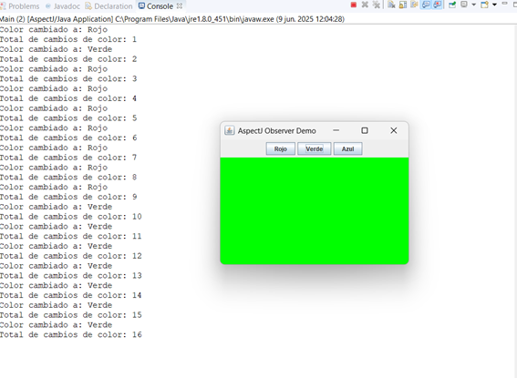

# AspectJ-Observer

Este proyecto implementa el patrón Observer usando AspectJ y una interfaz gráfica en Java.

## Funcionalidades

- Ventana con 3 botones: Rojo, Verde y Azul.
- Cada botón cambia el color de fondo de la ventana.
- Uso de AspectJ para interceptar cambios de color y mostrar el color en consola.
- **Funcionalidad adicional:** Se cuenta cuántas veces se ha cambiado el color usando otro aspecto.

## Ejemplo de salida en consola

## Autor 
Steven Avelino Palaguachi, Mateo Gallegos, Jose Gavino

